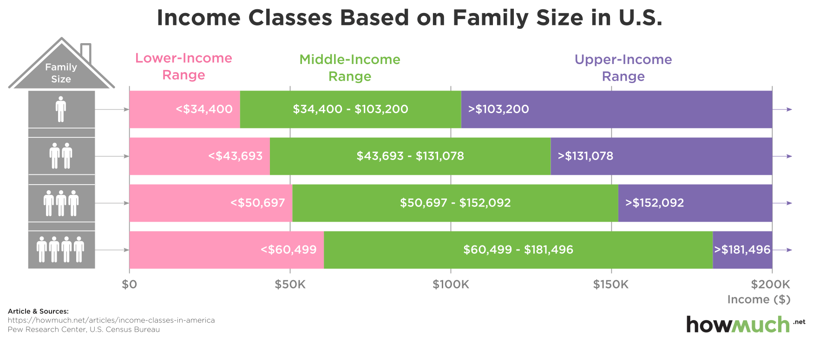
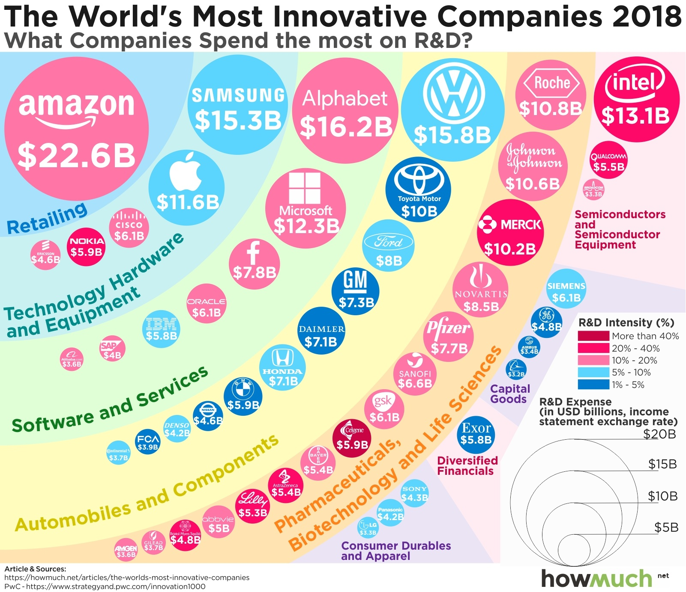
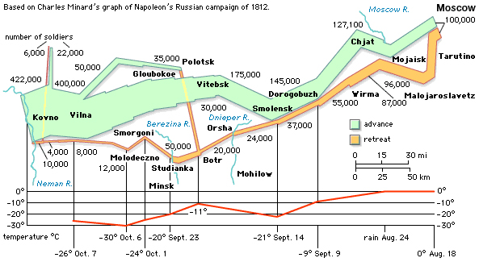

# A collection of nice figures

Figures always carry information, but nice figures will deliver messages in a more organized way. 

Using different colors, shapes, fonts or sizes, and alignment etc, will bring out a surprising effect.

Here I collected some nice figures as examples to follow.

## Income classes based on family size in U.S.

https://howmuch.net/articles/income-classes-in-america

## The world's most innovative companies 2018

https://howmuch.net/articles/the-worlds-most-innovative-companies

## Graph of napoleon's Russian campaign of 1812

http://www.emersonkent.com/map_archive/russian_campaign_1812.htm

